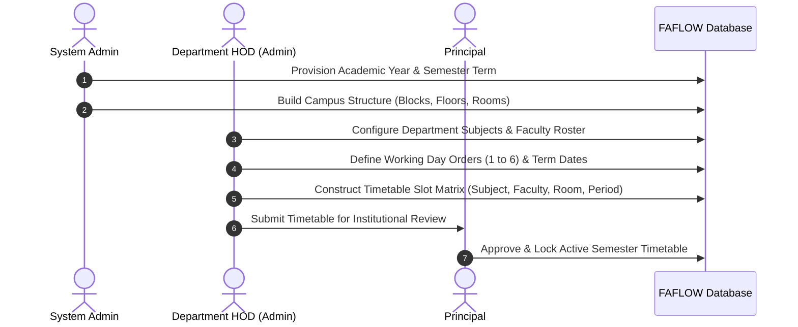
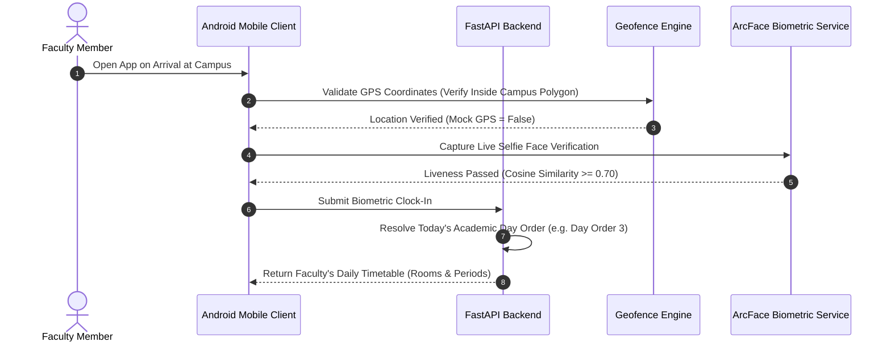
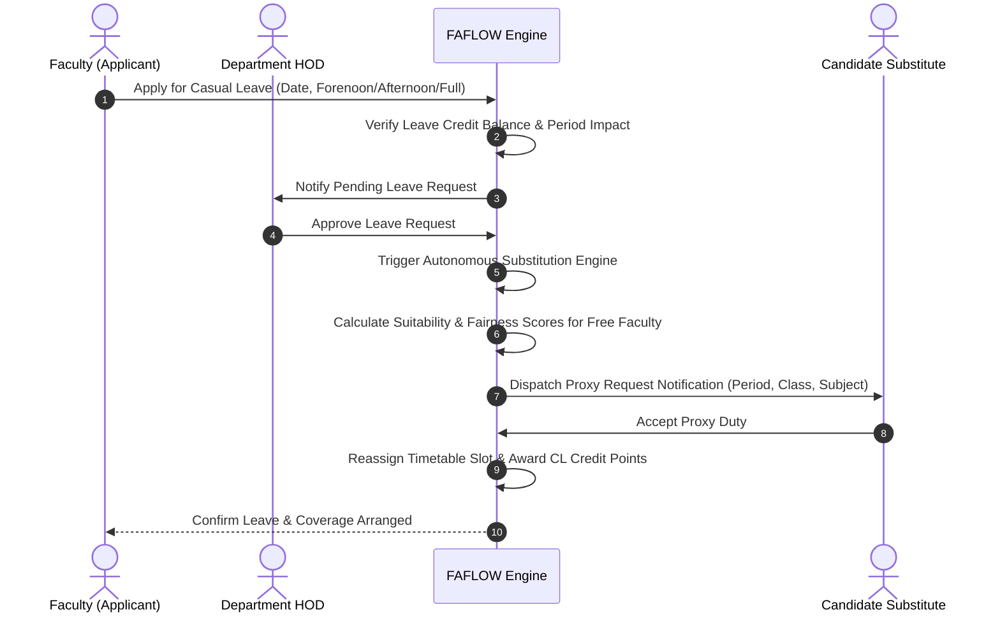
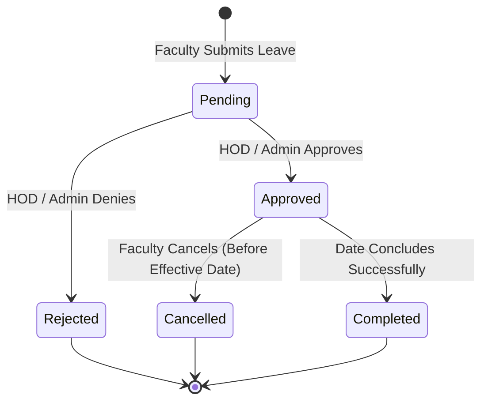
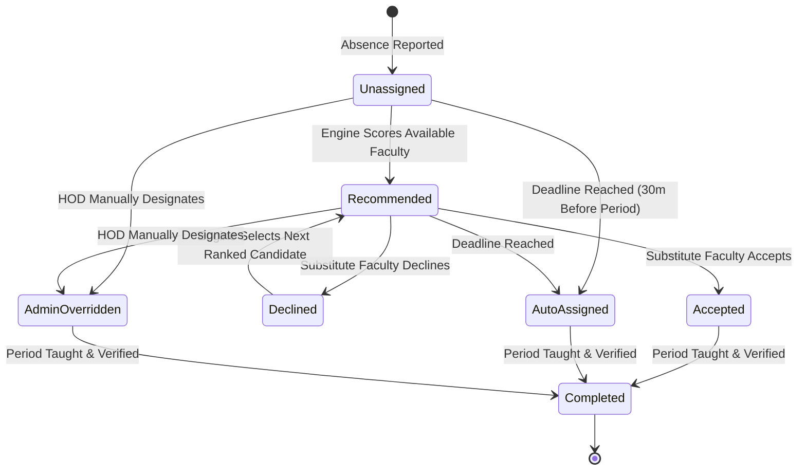
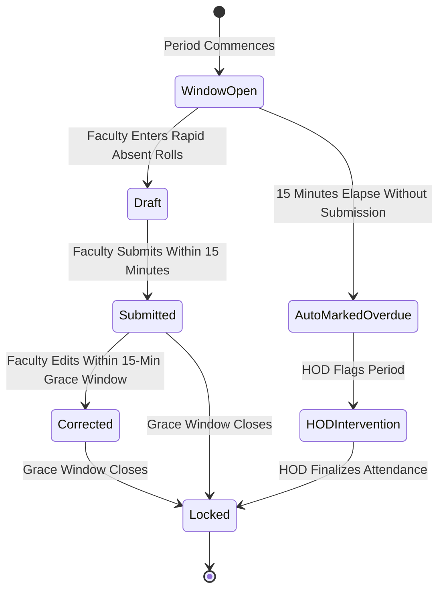

# FAFLOW — Master Architecture, Business Logic & Core Concepts Specification

> **Platform**: FAFLOW — Unified Institutional Attendance & Faculty Management Platform  
> **Document Version**: 1.0.0 (Master Reference Specification)  
> **Target Audience**: Institutional Administrators, System Architects, Full-Stack Engineers, Product Managers  
> **Status**: Verified & Active (Milestone 18 Hardened, 635/635 Tests Passing)  

---

## 1. Executive Overview & Problem Domain

Higher education institutions (universities, engineering colleges, polytechnics, autonomous arts & science colleges) manage complex daily operations governed by specialized operational rules that standard enterprise HR software cannot handle:

1. **Static Weekday Schedules Break Academic Continuity**: When unexpected holidays occur on Mondays or Fridays, courses scheduled on those days systematically fall behind the curriculum syllabus. FAFLOW enforces a **Cyclic Day Order Schedule (Day Order 1 through 6)** that rotates continuously regardless of standard calendar weekdays.
2. **Faculty Absences Create Campus Unattended Classes**: When a faculty member takes leave, finding a qualified, available substitute across overlapping periods, departments, and workload quotas is an administrative bottleneck. FAFLOW's **Autonomous Substitution Engine** computes availability, domain proximity, and workload fairness to recommend or auto-assign substitutes in minutes.
3. **Buddy-Punching & Remote Attendance Fraud**: Paper registers, RFID cards, or unprotected mobile apps allow fraudulent attendance. FAFLOW combines **512-dimensional facial biometric vector verification (ArcFace)**, **passive liveness checking**, **campus geofence boundary validation**, and **hardware GPS mock-provider detection**.
4. **Period-Level Student Attendance Bottlenecks**: Recording attendance for 60+ students per class across 6–8 periods daily consumes 10–15 minutes per hour. FAFLOW provides a **3-digit rapid roll entry system** with a strict 15-minute verification window and automatic absent notification.
5. **Multi-Tier Separation of Control**: Colleges have distinct administrative hierarchies: Institutional Trustees (`governance`), Academic Heads (`principal`), Department Chairs (`admin`/HOD), Faculty (`teacher`), Operations Managers (`manager`), Technical/Lab Staff (`staff`), and Infrastructure Operators (`system_admin`).

---

## 2. Core Business Concepts & Domain Models

```
+------------------------------------------------------------------------------------+
|                               FAFLOW CORE DOMAIN MODEL                             |
+------------------------------------------------------------------------------------+
|  [ Academic Calendar ] ---> [ Day Order (1-6) ] ---> [ Timetable Slot Matrix ]    |
|                                                                 |                  |
|                                                                 v                  |
|  [ Leave Request ] ---------> [ Absence Detection ] ---> [ Substitution Engine ]   |
|         |                                                       |                  |
|         v                                                       v                  |
|  [ CL Credit Balance ] <--------------------------------- [ Credit Recognition ]   |
|                                                                                    |
|  [ Geofence Boundaries ] + [ ArcFace Biometrics ] ------> [ Faculty Attendance ]   |
|                                                                                    |
|  [ Timetable Schedule ] + [ 15-Min Window ] ------------> [ Student Attendance ]   |
|                                                                                    |
|  [ Institutional Policy ] + [ Guided Tour ] ------------> [ Verified Onboarding ]  |
+------------------------------------------------------------------------------------+
```

### 2.1 Academic Calendar & Dynamic Day Order Rotation
Unlike corporate 9-to-5 schedules, collegiate institutions operate on **Day Orders** (typically Day Order 1 through Day Order 6):
- **Working Day Order**: Each academic working day is assigned an integer order (1 to 6). Timetable schedules map directly to `day_order`, not Monday–Saturday.
- **Holiday Preservation Rule**: If Tuesday is declared an unexpected storm holiday, Wednesday inherits Tuesday's scheduled Day Order. Syllabus hours remain perfectly balanced across all subjects throughout the semester.
- **Calendar Day Types**:
  - `working`: Classes in session; requires Day Order (1–6).
  - `holiday`: Institutional holiday; no periods or attendance required.
  - `exam`: Examination session; regular timetable suspended, exam invigilation duties active.
  - `event`: Cultural/sports symposium; regular timetable suspended.
  - `flexible`: Autonomous emergency override mode for governance-controlled schedules.

### 2.2 Timetable & Dynamic Slot Mapping
A timetable slot represents a confirmed educational commitment defined by the tuple:
$$\text{Slot} = (\text{Department}, \text{Term}, \text{Day Order}, \text{Period}, \text{Section}, \text{Batch}, \text{Subject}, \text{Teacher}, \text{Room})$$

- **Period Granularity**: Typically 6 to 8 periods per working day (e.g., Period 1: 09:00–09:50, Period 2: 09:50–10:40, etc.).
- **Batch Splitting**: Laboratory practicals split a single class section into Batches (e.g., Batch A in Network Lab, Batch B in Microprocessor Lab).
- **Combined Sections**: Theory subjects sharing a common lecture hall link multiple sections under a single faculty member with an optional co-teacher.

### 2.3 Leave Management & Casual Leave Credits
Faculty absences impact institutional operations directly. FAFLOW implements a dual-balance leave and recognition system:
- **Leave Classifications**:
  - **Casual Leave (CL)**: Regular planned personal leave deducted from annual quota.
  - **On Duty (OD)**: Official deputation (university valuation, research conference, symposium escort); does not consume personal leave.
  - **Medical Leave (ML)**: Extended health leave requiring administrative documentation.
  - **Emergency Leave**: Unforeseen absence applied on the same morning, immediately triggering the substitution alert engine.
- **Half-Day Shifts**: Leaves support `forenoon` (periods 1–4) or `afternoon` (periods 5–8) granularity to prevent full-day class cancellations.
- **Casual Leave Credit Ledger**:
  - Covering proxy substitution periods earns faculty **Credit Points** logged in an immutable `credit_transactions` ledger.
  - Earned credits can be redeemed for compensatory leave or acknowledged in annual performance reviews, incentivizing voluntary substitution coverage.

### 2.4 Autonomous Substitution & Fairness Allocation Engine
When a faculty member's leave is approved (or reported as an emergency), their scheduled timetable slots for that date become **Unattended Periods**. The engine executes a multi-factor recommendation algorithm:

$$\text{Suitability Score} = W_{\text{free}} \cdot S_{\text{availability}} + W_{\text{dept}} \cdot S_{\text{dept}} + W_{\text{load}} \cdot (1 - \text{Workload Ratio}) + W_{\text{fair}} \cdot S_{\text{fairness}}$$

1. **Hard Availability Filter**:
   - The candidate faculty must NOT have a scheduled class in that period.
   - The candidate faculty must NOT be on approved leave or assigned to another duty.
   - The candidate faculty must NOT exceed the maximum daily substitution limit (governance rule: default max 2 proxy periods/day).
2. **Department & Domain Match**:
   - Faculty in the same department teaching related subject domains receive highest priority.
3. **Fairness & Workload Balancing**:
   - Faculty with lower total substitution duty counts across the current semester are prioritized to prevent faculty burnout.
4. **Allocation Lifecycles**:
   - `unassigned`: Slot vacant, awaiting candidates.
   - `recommended`: Algorithmic suggestions dispatched to HOD.
   - `accepted`: Substitute faculty accepts proxy duty.
   - `declined`: Substitute faculty declines; engine cascades to next candidate.
   - `auto_assigned`: Background daemon (APScheduler) auto-allocates duty if unfilled 30 minutes before period start.
   - `admin_overridden`: HOD or Principal explicitly designates substitute.

### 2.5 Biometric Facial Verification & Campus Geofencing
To verify physical presence without hardware fingerprint lines:
- **On-Device Face Detector**: InsightFace SCRFD extracts 5 key facial landmarks (left eye, right eye, nose tip, left mouth corner, right mouth corner).
- **Deep Feature Embeddings**: ArcFace model transforms normalized 112×112 face crop into a **512-dimensional unit-length float vector**.
- **Cosine Similarity Verification**:
  $$\text{Cosine Similarity} = \frac{\mathbf{u} \cdot \mathbf{v}}{\|\mathbf{u}\| \|\mathbf{v}\|} \ge 0.70$$
  Matches reference enrollment vector stored securely during staff registration.
- **Passive Liveness**: Natural eye blink and micro-head rotation verification prevents photographic or screen replay attacks.
- **Dual Geofence Perimeter**:
  - **Polygon Coordinates**: Precise multi-vertex campus perimeter enclosing college buildings, laboratories, and grounds.
  - **Haversine Radius Check**: Fallback circular perimeter with configurable radius (e.g., 200m).
  - **Mock GPS Defense**: Android `isFromMockProvider()` blocks spoofing apps and Developer Option mock locations.

### 2.6 Period-Level Student Attendance System
- **15-Minute Start Window**: Faculty can only submit student attendance within 15 minutes of period start, ensuring students are marked while present in the room.
- **3-Digit Rapid Roll Entry**: Faculty enter only absent roll numbers (e.g., `004, 018, 042`). All remaining students in the roster default to `present` instantaneously.
- **15-Minute Correction Grace Period**: Faculty can adjust erroneous marks within 15 minutes of initial submission; after 15 minutes, records are cryptographically locked and require HOD approval to alter.
- **On Duty (OD) Protection**: Students flagged with approved college duty (sports, symposiums) cannot be marked absent.

### 2.7 Institutional Announcements & Official Directives
Official communication channel replacing chaotic group messaging:
- **Audience Targeting**: Scope directives to `Institution-wide`, `Department-specific`, `Faculty-only`, or `Student-visible`.
- **Compliance Acknowledgement**: High-priority circulars require mandatory "Read & Acknowledged" confirmation logging timestamp and user ID.
- **Threaded Clarifications**: Faculty can ask official clarifying questions beneath circulars with `@mention` notifications.

### 2.8 Multi-Tier Institutional Governance (7 Canonical Roles)

| Role | Domain Scope | Primary Responsibilities |
|---|---|---|
| `system_admin` | Global Infrastructure | Platform configuration, database backups, tenant department provisioning, audit log reviews. |
| `admin` (HOD) | Department Level | Timetable construction, faculty rosters, leave approvals, substitution management, student attendance monitoring. |
| `governance` | Institutional Oversight | Non-editing executive audit access, fairness reports, cross-department analytics, emergency controls. |
| `principal` | Academic Leadership | College-wide attendance, curriculum tracking, inter-departmental timetable, institutional settings. |
| `manager` | Operational Facilities | Non-teaching staff, laboratory technicians, maintenance staff rosters, operational leave requests. |
| `teacher` | Academic Faculty | Daily period attendance marking, personal timetable, leave applications, substitution proxy duties, credit balance. |
| `staff` | Operational Support | Laboratory assistance, facility maintenance, daily biometric check-in/out, leave applications. |

---

## 3. End-to-End Operational Lifecycle Flows

### Flow 1: Semester Initialization & Timetable Setup


### Flow 2: Daily Morning Attendance & Schedule Resolution


### Flow 3: Planned Leave Application & Autonomous Substitution


### Flow 4: Period-Level Student Attendance Marking
```mermaid
sequenceDiagram
    autonumber
    actor Fac as Classroom Faculty
    participant Web as Web / Mobile UI
    participant API as Attendance Service
    participant DB as PostgreSQL Database

    Fac->>Web: Open Current Period Attendance (Within 15-min Window)
    Web->>API: Fetch Class Section Roster
    API-->>Web: Return Enrolled Students & Approved OD Badges
    Fac->>Web: Enter 3-Digit Absent Roll Numbers (e.g., 007, 023)
    Web->>API: Submit Period Attendance Record
    API->>DB: Store Period Attendance (Present: 58, Absent: 2, OD: 1)
    Note over API,DB: 15-Minute Grace Period Active for Faculty Corrections
    API->>API: Lock Record After 15 Minutes; Push Absent Alerts
```

---

## 4. State Transition Machines

### 4.1 Leave Request State Machine


### 4.2 Substitution Slot Lifecycle


### 4.3 Period Attendance Record Lifecycle


---

## 5. Architectural Stability & Verification Guarantee

FAFLOW is engineered with enterprise reliability patterns:
1. **Database Row Locks (`with_for_update`)**: Applied during substitution allocations and leave credit balance deductions to guarantee zero race conditions under concurrent requests.
2. **Double Route Mounting (`/` and `/api/`)**: All 34 backend router modules respond identically across root and `/api` prefixes, eliminating client version mismatch issues.
3. **Canonical Dependency Injection (`app.core.dependencies`)**: Authentication, user role resolution, and tenant department scoping are enforced at the ASGI framework boundary before controller execution.
4. **Automated Test Certification**:
   - **Backend**: **635 test cases passing** across 58 test modules (`pytest -q` exited with code 0).
   - **Frontend**: Vite 5 production bundle compiles cleanly with 0 syntax or chunking errors (`npm run build` completed in 16.66s).
   - **Mobile**: Jetpack Compose BOM 2025.02.00 hardened with 16 KB native memory page alignment for modern Android 15/16 devices.

---

*This document serves as the canonical source of truth for FAFLOW's system architecture, domain models, business logic, and operational workflows.*
